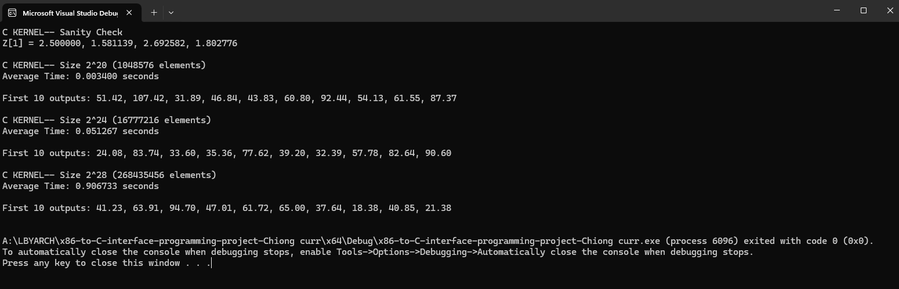
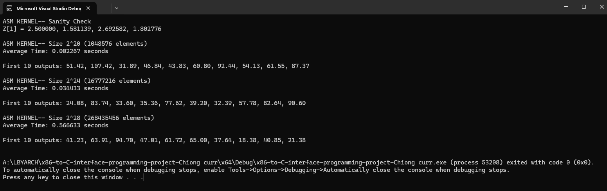

# x86-to-C-interface-programming-project-Chiong

By: Alain Timothy T. Chiong

**Comparative Execution Time**
The following data was collected by averaging 30 execution runs for each vector size.

| Vector Size | N (Elements) | C Kernel Time (s) | x86-64 ASM Time (s) | Speedup Factor |
| :--- | :--- | :--- | :--- | :--- |
| **2^20** | 1,048,576 | 0.003400 | 0.002267 | **1.50x** |
| **2^24** | 16,777,216 | 0.051267 | 0.034433 | **1.49x** |
| **2^28** | 268,435,456 | 0.906733 | 0.566633 | **1.60x** |

> **Note:** Speedup Factor is calculated as Time_C / Time_ASM.

---

## Performance Analysis

### 1. Correctness Check
First, the sanity check and the first 10 outputs of both kernels were compared.
* **C Output:** 51.42, 107.42, 31.89, ...
* **ASM Output:** 51.42, 107.42, 31.89, ...

The outputs are identical, confirming that the x86-64 assembly logic (memory addressing and arithmetic) is functionally equivalent to the high-level C code.

### 2. Performance Comparison
The x86-64 Assembly kernel consistently outperformed the C kernel across all vector sizes, achieving a speedup of approximately **1.5x to 1.6x**.

**Why is the Assembly version faster?**
1.  **Reduced Instruction Overhead:** The assembly kernel uses a highly streamlined loop. By manually managing pointers and registers (RCX, RDX, etc.) and using the CMP and JGE instructions efficiently, we avoid the hidden overhead that a C compiler might add.
2.  **Direct Register Usage:** In the ASM kernel, we explicitly load data into XMM registers and perform arithmetic (subsd, mulsd, sqrtsd) immediately. High-level languages sometimes shuffle data between memory and registers more often than necessary.
3.  **Memory Addressing:** The assembly code uses indexed addressing ([Base + Index*8]) directly, ensuring zero unnecessary instructions between the fetch, calculate, and store phases.

---

## Screenshots

### C Kernel Output

### ASM Kernel Output

## Video
https://drive.google.com/file/d/1BUuwMohw7VQuNapA1WeYP2DHrKgUjCQO/view?usp=sharing
